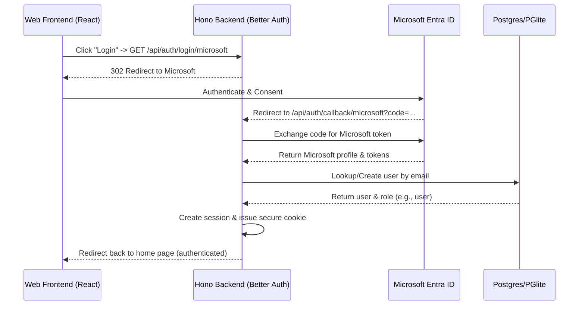

# Microsoft Entra SSO and User Administration using Better Auth

> **Plan:** docs/plans/2026-06-07-002-feature-sso-and-admin-plan.md
> **Status:** Draft
> **Type:** feature  ·  **Depth:** Deep

## Problem & Scope

The self-hosted Skill Library currently relies on static API keys (`SKILL_LIBRARY_API_KEYS`) and development headers (`x-skill-library-role`) for access control. While simple, this does not meet enterprise requirements for single sign-on (SSO), secure browser sessions, or dynamically managed user roles.

This plan outlines the design and implementation of **Microsoft Entra ID SSO** and session management using **Better Auth**, alongside an **Admin Panel** for local user role management.

### In Scope
- **Database Schema Updates**: Add Better Auth tables (`user`, `session`, `account`, `verification`) to Postgres and PGlite.
- **Better Auth Integration**: Configure Better Auth with Microsoft Entra ID as a social provider.
- **Custom Database Adapter**: Implement a custom database adapter for Better Auth that forwards queries to our unified `RegistryStore` database runner, enabling seamless compatibility with both external Postgres and WASM-based PGlite.
- **Role Extension**: Extend the Better Auth user schema with a custom `role` field (`user`, `maintainer`, `admin`) to govern permission ranks.
- **Admin Control Panel**: Add a user management interface in the React frontend, visible only to users with the `admin` role, allowing them to promote/demote user roles or delete users.
- **Backwards Compatibility**: Keep the static API key auth functional so that CLI and MCP tools continue to work without modification.
- **Bootstrap Admin Logic**: Automatically promote the very first user who logs in via SSO to `admin` to bootstrap the system without seed scripts.

### Out of Scope
- **Multi-Tenant SSO**: Designing the library to support multiple independent corporate domains simultaneously (we focus on a single organization tenant configuration).
- **Interactive CLI Auth Flow**: Having the CLI open a browser to authenticate via OAuth; CLI tools will continue using API tokens.
- **Custom Username/Password Registration**: User accounts are strictly created via Entra ID SSO.

---

## Requirements Traceability

- **R1** — Support Microsoft Entra ID SSO for user authentication in the web interface using Better Auth. — _this conversation_
- **R2** — Define global user roles (`user`, `maintainer`, `admin`) mapping to existing Hono routes and frontend controls. — _this conversation_
- **R3** — Provide an Admin interface in the web application for managing user roles. — _this conversation_
- **R4** — Retain static API keys for CLI and MCP agent integration. — _this conversation_

---

## Specification

### User Stories

1. **As a user**, I want to click a "Login with Microsoft" button in the web UI, so that I can authenticate using my company credentials.
2. **As a user**, I want to remain logged in securely via cookies, so that I can seamlessly browse and publish skills.
3. **As a user**, I want to view my profile information (name, email, role) and have a "Logout" button, so that I can manage my active session.
4. **As an administrator**, I want to access an "Admin" tab in the navigation bar, so that I can manage the users registered in the system.
5. **As an administrator**, I want to view a table of all registered users (name, email, role, joined date) and search/filter them.
6. **As an administrator**, I want to update any user's role (e.g., from `user` to `maintainer` or `admin`) or remove their access entirely, so that I can enforce security policy.
7. **As the first administrator**, I want to automatically receive the `admin` role upon my first login, so that I can configure the registry immediately after deployment.

### Behavioral Contract

#### Backend Routes
- **Better Auth Endpoints**:
  - `GET/POST /api/auth/*`: Handled by Better Auth middleware (handles login redirection, OAuth callbacks, session verification, and logouts).
- **Admin Endpoints**:
  - `GET /api/admin/users`: Lists all users. Restricted to `admin` role.
  - `PATCH /api/admin/users/:userId`: Modifies a user's role. Restricted to `admin` role.
  - `DELETE /api/admin/users/:userId`: Deletes a user. Restricted to `admin` role.

#### Session Flow Diagram


---

## Key Technical Decisions

- **D1 — Better Auth Framework**: We will use Better Auth for session and social login management.
  - *Rationale*: Better Auth handles the state-of-the-art security details of OAuth 2.0 / OIDC handshake, session rotation, CSRF protection, and cookies, saving hundreds of lines of custom security implementation.
- **D2 — Custom Database Adapter for unified storage**: We will implement a custom Better Auth database adapter that converts CRUD operations into SQL statements run against the `RegistryStore` database connection.
  - *Rationale*: The Skill Library supports both PGlite (local WASM) and Postgres (external database URL) via its own database client abstraction. Implementing a custom adapter of ~60 lines of code lets Better Auth query the active database mode without needing complex multi-dialect Kysely or Drizzle connection configurations.
- **D3 — Cookie-Based Web Session & Header-Based API Key Fallback**: The web application will use secure HTTP-only cookies, while CLI/MCP routes continue to check `Authorization: Bearer <key>`.
  - *Rationale*: Cookies are the secure standard for browser authentication. CLI and MCP clients work best with static keys passed via headers.
- **D4 — User Database Persistence**: We will add the required Better Auth tables (`user`, `session`, `account`, `verification`) to our database.
  - *Rationale*: Better Auth requires a database backing to manage session persistence and accounts.

---

## High-Level Design

The additions are integrated into the existing packages:
1. **`packages/storage`**: Adds migrations for the Better Auth tables and exposes the database client to the backend for custom adapter integration.
2. **`apps/server`**:
   - `better-auth.ts` [NEW]: Initializes the Better Auth instance with the custom database adapter and Microsoft credentials.
   - `auth.ts`: Refactored to support static API keys as primary header check, and then falling back to checking Better Auth's active session.
   - `http.ts`: Mounts Better Auth handler to `/api/auth/*` and registers the `/api/admin/*` routes.
3. **`apps/web`**:
   - `ui.tsx`: Integrates login controls, logs out via Better Auth client/endpoints, and renders the Admin panel.

---

## Implementation Units

### U1 — Better Auth Database Migrations

- **Goal:** Create the database tables required by Better Auth.
- **Depends on:** none
- **Files:**
  - `packages/storage/src/index.ts`
- **Approach:**
  - Add a new migration to the `migrations` array in `packages/storage/src/index.ts` creating tables: `"user"`, `"session"`, `"account"`, and `"verification"`.
  - Tables and fields will be defined to match Better Auth's PostgreSQL requirements (double-quoting reserved keywords like `"user"`, `"session"` and case-sensitive camelCase columns):
    ```sql
    create table if not exists "user" (
      id text primary key,
      name text not null,
      email text not null unique,
      "emailVerified" boolean not null default false,
      image text,
      role text not null default 'user',
      created_at timestamptz not null default now(),
      updated_at timestamptz not null default now()
    );

    create table if not exists "session" (
      id text primary key,
      "expiresAt" timestamptz not null,
      token text not null unique,
      created_at timestamptz not null default now(),
      updated_at timestamptz not null default now(),
      ip_address text,
      user_agent text,
      "userId" text not null references "user"(id) on delete cascade
    );

    create table if not exists "account" (
      id text primary key,
      "accountId" text not null,
      "providerId" text not null,
      "userId" text not null references "user"(id) on delete cascade,
      "accessToken" text,
      "refreshToken" text,
      "idToken" text,
      "expiresAt" timestamptz,
      password text,
      created_at timestamptz not null default now(),
      updated_at timestamptz not null default now()
    );

    create table if not exists "verification" (
      id text primary key,
      identifier text not null,
      value text not null,
      "expiresAt" timestamptz not null,
      created_at timestamptz not null default now(),
      updated_at timestamptz not null default now()
    );
    ```
- **Test scenarios:**
  - Given a fresh database migration, when database migrations run, then the tables are created successfully.
- **Verification:** Run `pnpm -F @skill-library/storage test`.

### U2 — Custom Better Auth Database Adapter

- **Goal:** Implement the Better Auth adapter interface mapped to `RegistryStore`.
- **Depends on:** U1
- **Files:**
  - `apps/server/src/better-auth-adapter.ts` [NEW]
- **Approach:**
  - Use `createAdapter` from `better-auth/adapters`.
  - Map CRUD operations to SQL queries executed on the underlying query engine.
  - Implement methods:
    - `create(model, values)`: `insert into "${model}" (keys...) values (values...) returning *`
    - `findOne(model, { where })`: `select * from "${model}" where cond1 and cond2 ... limit 1`
    - `findMany(model, { where })`: `select * from "${model}" where cond1 and cond2 ...`
    - `update(model, { where, values })`: `update "${model}" set keys=values where conds returning *`
    - `delete(model, { where })`: `delete from "${model}" where conds`
  - Properly handle double-quoting camelCase column names during SQL building.
- **Test scenarios:**
  - Verify that the custom adapter can insert and retrieve users and sessions on both PGlite and Postgres.
- **Verification:** Run server typescript compilation checks.

### U3 — Better Auth Hono Mount and Config

- **Goal:** Configure Better Auth and mount it to `/api/auth/*` in Hono.
- **Depends on:** U2
- **Files:**
  - `apps/server/src/better-auth.ts` [NEW]
  - `apps/server/src/http.ts`
  - `apps/server/package.json`
- **Approach:**
  - Install dependencies `better-auth` in `apps/server`.
  - In `better-auth.ts`, initialize the Better Auth object:
    - Pass the custom database adapter.
    - Add custom `role` field configuration to the `user` model.
    - Configure `socialProviders.microsoft` using environment variables:
      - `BETTER_AUTH_URL` (URL of the registry)
      - `MICROSOFT_CLIENT_ID`
      - `MICROSOFT_CLIENT_SECRET`
      - `MICROSOFT_TENANT_ID`
  - Mount Better Auth into Hono in `apps/server/src/http.ts`:
    ```typescript
    app.on(["POST", "GET"], "/api/auth/*", (c) => auth.handler(c.req.raw));
    ```
- **Test scenarios:**
  - Request `/api/auth/get-session` returns a `200 OK` (with null session when not logged in).
- **Verification:** Run `pnpm -F @skill-library/server test`.

### U4 — Authentication Refactoring

- **Goal:** Update request authentication logic to check both static API keys and Better Auth sessions.
- **Depends on:** U3
- **Files:**
  - `apps/server/src/auth.ts`
- **Approach:**
  - In `actorFromHeaders` or a new session helper:
    - Read `Authorization` header. If it's a bearer token, check against `SKILL_LIBRARY_API_KEYS`.
    - If no key matches, query Better Auth's session API:
      `const session = await auth.api.getSession({ headers })`
    - If a session is resolved, fetch the user's role from the session profile.
    - Set the `Actor` dynamically: `{ id: session.user.email, role: session.user.role }`.
- **Test scenarios:**
  - Given a request with a valid static API key, when headers are evaluated, then the correct static actor is resolved.
  - Given a request with a valid session cookie, when headers are evaluated, then the logged-in session user's actor is resolved.
- **Verification:** Run existing tests to ensure static key auth compatibility.

### U5 — Admin User Management APIs

- **Goal:** Expose routes for administrators to manage user access.
- **Depends on:** U4
- **Files:**
  - `apps/server/src/http.ts`
- **Approach:**
  - Create routes:
    - `GET /api/admin/users`: Returns all users from the `"user"` table. Restricted to `admin` role.
    - `PATCH /api/admin/users/:userId`: Modifies the `role` column for a user. Restricted to `admin` role.
    - `DELETE /api/admin/users/:userId`: Deletes the user. Restricted to `admin` role.
  - Implement bootstrap logic in Better Auth hooks or callback: on user registration, if `select count(*) from "user"` is 0, assign `"admin"` role; otherwise default to `"user"`.
- **Test scenarios:**
  - Given a non-admin session, when requesting `/api/admin/users`, then `403 Forbidden` is returned.
  - Given an admin session, when requesting `/api/admin/users`, then the users list is returned.
- **Verification:** Write unit tests in `http.test.ts`.

### U6 — Frontend Login and Session Controls

- **Goal:** Add login/logout triggers and handle session checks on the frontend.
- **Depends on:** U5
- **Files:**
  - `apps/web/src/ui.tsx`
  - `apps/web/package.json`
- **Approach:**
  - If the user is unauthenticated:
    - Show a clean sign-in screen with a "Sign in with Microsoft" button.
    - The button redirects to `/api/auth/login/social?provider=microsoft&callbackURL=/`.
  - Fetch profile using `/api/auth/get-session` on mount to populate username, email, and role badge.
  - Add a "Logout" button that calls `/api/auth/sign-out` and reloads.
- **Test scenarios:**
  - Given an unlogged session, then the Microsoft login layout is displayed.
  - Given a logged-in session, then the library catalog is shown with user details in the header.
- **Verification:** Run `pnpm -F @skill-library/web build`.

### U7 — User Administration dashboard

- **Goal:** Add a GUI interface for user management.
- **Depends on:** U6
- **Files:**
  - `apps/web/src/ui.tsx`
  - `apps/web/src/styles.css`
- **Approach:**
  - Add an "Admin" tab to the header. Show it only if `role === 'admin'`.
  - Display a clean table listing all users in the system.
  - Add dropdown controls to modify user roles and a button to revoke access.
- **Test scenarios:**
  - Verify that only admins can access the tab and trigger changes.
- **Verification:** Visual review in browser.

### U8 — Configuration & Docker Updates

- **Goal:** Configure compose and env files for Better Auth.
- **Depends on:** U7
- **Files:**
  - `.env.example`
  - `docker-compose.yml`
  - `README.md`
- **Approach:**
  - Document required environment variables:
    - `BETTER_AUTH_SECRET` (used to encrypt session data)
    - `BETTER_AUTH_URL`
    - `MICROSOFT_CLIENT_ID`
    - `MICROSOFT_CLIENT_SECRET`
    - `MICROSOFT_TENANT_ID`
  - Update configurations.
- **Verification:** Run `pnpm verify` to check code compilation and tests.

---

## Risks & Mitigations

- **Risk: Microsoft login callback unreachable locally**
  - *Mitigation*: Support a local dev bypass configuration where header-based dev authentication remains active if `NODE_ENV === 'development'` is set, allowing developers to test the app without registering active Azure App registrations locally.

---

## Alternatives Considered

- **Alternative: NextAuth / Auth.js**
  - *Rejected because*: NextAuth is heavily coupled to Next.js APIs. Better Auth has a clean, framework-agnostic core which is significantly easier to mount in raw Hono instances and run efficiently in lightweight containers.
