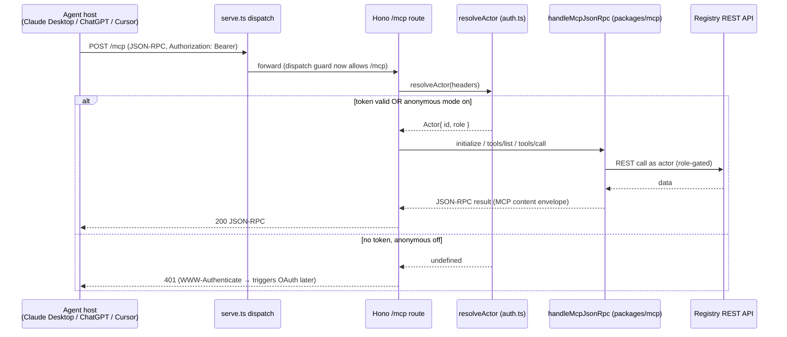

# feat: Remote MCP endpoint + npx CLI (connect & install model)

## Summary

Make the skill registry usable without a terminal-heavy setup by adding two low-friction paths: a **hosted remote (streamable-HTTP) MCP endpoint** so agents *connect once* (no clone/build), and a **standalone `npx` CLI** so users *install skills to disk* with one command. Web onboarding is rewritten to separate the two primitives — "Connect the library" vs "Install a skill". Authenticated access for Claude.ai web + ChatGPT requires OAuth, which is **unproven on the current Better Auth setup**, so P2 (OAuth) is scoped as a validation spike now and a deferred build later. P1 (bearer + optional no-auth transport), B (npx CLI), the copy rewrite, and doc updates are the active, shippable scope.

The active scope reaches Claude Desktop, Claude Code, and Cursor immediately (bearer header), and reaches *every* surface (incl. ChatGPT/Claude.ai web) for network-gated instances via opt-in no-auth.

---

## Problem Frame

Every install path today requires a terminal — `git clone` → `pnpm install` → `pnpm build`, then CLI flags or a locally-built stdio MCP server (see origin: `docs/brainstorms/2026-06-10-connect-and-install-model-requirements.md`). No single path lands a skill in an agent for a non-technical user, and ChatGPT (remote-connector-only, no skill-folder concept) dead-ends entirely because the registry exposes no hosted MCP endpoint. The three mechanisms (MCP discovers, CLI installs-to-dev-folders, web hands out ZIPs) each solve a slice with the seams exposed.

The fix is two clean primitives:
- **Connect the library** (remote MCP endpoint) — paste a URL/token once; the agent searches and uses skills live. Works across all surfaces.
- **Install a skill** (npx CLI) — one command persists skill files to disk. Remote MCP structurally cannot write a user's disk, so the CLI remains the persist path.

---

## Requirements

Traced from the origin requirements doc:

- **R1** — Expose the existing 5 MCP tools (`search`, `packageDetail`, `validatePackage`, `installPlan`, `submitStatusReport`) over a remote HTTP transport on the existing server, reusing the existing tool/dispatch logic.
- **R2** — Remote endpoint is spec-compliant enough for real connectors: supports the `initialize` handshake and MCP content-envelope, not just `tools/list`/`tools/call`.
- **R3** — P1 auth: accept the existing `Authorization: Bearer` tokens (static `SKILL_LIBRARY_API_KEYS` + personal `sl_` tokens) over HTTP, reusing the current resolution path. Works for Claude Desktop / Claude Code / Cursor.
- **R4** — Optional **no-auth mode**, off by default, env-gated, intended only for instances where the network is the perimeter (VPN/SSO-gated or trusted LAN). When enabled it reaches ChatGPT + Claude.ai web.
- **R5** — Write-capable tools (`validatePackage`, `submitStatusReport`) stay role-gated by the resolved token even over HTTP; never reachable with an absent/insufficient token.
- **R6** — `npx @skill-library/cli install <slug>` works with no clone and no build, resolving sensible defaults so `--workspace`/`--root` are not required.
- **R7** — The CLI is published to public npm as a self-contained package (workspace deps bundled, not `workspace:*`).
- **R8** — Web onboarding presents one path per surface: "Connect the library" (primary, remote connector) vs "Install a skill" (disk). The stdio prompt-wall is demoted to a power-user/offline section, and the ChatGPT path stops dead-ending.
- **R9** — P2 (OAuth for authenticated Claude.ai web + ChatGPT) is validated by a spike that proves or disproves Better Auth as the authorization server before any OAuth build is committed.

**Success criteria** (origin): a user connects Claude Desktop to a reachable instance with no terminal and the agent searches the catalog; ChatGPT either connects (no-auth/OAuth) or shows an honest reason, never a dead-end config; a developer installs to `~/.claude/skills` with one `npx` command; web onboarding shows one path per surface.

---

## Key Technical Decisions

- **KTD1 — Reuse `handleMcpJsonRpc`, extend it for remote.** The JSON-RPC dispatcher in `packages/mcp/src/index.ts` is already transport-agnostic (no stdio entanglement). Extend it to add `initialize` + `notifications/initialized` + the MCP `{content:[{type:"text",…}]}` result envelope, rather than forking logic per transport. The stdio transport keeps working through the same core. *(see origin: Approach A)*
- **KTD2 — Mount `/mcp` at the root and edit the `serve.ts` dispatch guard.** `apps/server/src/serve.ts` only forwards `/api/*` and `/health` to Hono. The OAuth discovery doc **must** live at the root `/.well-known/oauth-protected-resource` (the spec forbids namespacing it), so the dispatch guard is edited to forward `/mcp` and `/.well-known/*` to Hono. `/mcp` sits at root (not `/api/mcp`) for a clean connector URL.
- **KTD3 — P1 auth reuses `resolveActor`.** The `/mcp` route calls `resolveActor(c.req.raw.headers)` (the existing `actorFromHeaders` closure in `apps/server/src/http.ts`), giving bearer-token → role/actor resolution identical to the REST API. No new auth model for P1.
- **KTD4 — No-auth is an explicit env opt-in.** A new env flag (e.g. `SKILL_LIBRARY_MCP_ALLOW_ANONYMOUS`) defaults to off. When on, the `/mcp` route serves an anonymous `user`-role actor. Write tools remain role-gated, so anonymous gets read-only discovery. This keeps the safe default safe while unlocking the all-surfaces path for network-gated deployments.
- **KTD5 — Bundle the CLI for npm.** `@skill-library/domain` and `@skill-library/validation` are `workspace:*` deps that do not resolve via npx outside the monorepo. Bundle them into the published `dist` (esbuild/tsup) so the artifact has zero `@skill-library/*` runtime deps. The CLI is a pure REST client, so bundling is realistic.
- **KTD6 — Publish to public npm under `@skill-library/cli`.** Drop `private`, add `files`/`publishConfig: { access: public }`, keep the existing `bin` name `skill-library`. *(decision: public npm, per planning confirmation)*
- **KTD7 — P2 OAuth is spike-gated.** Better Auth runs zero plugins today; MCP-compatible OAuth (PRM, PKCE S256, CIMD/DCR, resource indicators) is unproven on it. Prove it with a spike (U8) before committing the OAuth build, which is deferred. *(see origin: Outstanding Question — Better Auth as AS)*
- **KTD8 — Honor the PGlite single-writer guardrail.** The remote endpoint must not assume horizontal scaling; PGlite mode requires exactly one replica (stop-before-start deploys). No design choice here may depend on multiple writers.

---

## High-Level Technical Design

### Remote MCP request flow (P1)

### Auth by surface (drives phasing)

| Surface | Bearer header | No-auth endpoint | OAuth | Reached by |
|---|---|---|---|---|
| Claude Desktop / Claude Code / Cursor | ✅ | ✅ | optional | **P1** |
| Claude.ai web | ❌ | ✅ (experimental) | required | P1 (no-auth, gated) → **P2** (auth) |
| ChatGPT web (Dev Mode) | ❌ | ✅ | required | P1 (no-auth, gated) → **P2** (auth) |

P1 delivers the bearer surfaces fully and the web surfaces for network-gated instances. P2 (spike-then-build) unlocks authenticated web surfaces.

---

## Scope Boundaries

### In scope (active)
- Remote HTTP MCP transport (`/mcp`) with `initialize` + content envelope, bearer auth, optional no-auth.
- `serve.ts` dispatch edit to route `/mcp` and `/.well-known/*`.
- Standalone, public-npm-published CLI with `npx`-friendly install defaults.
- Web onboarding rewrite (connect vs install; remote-connector prompts; ChatGPT no longer dead-ends).
- `docs/mcp.md` + `docs/security.md` updates.
- P2 validation spike (Better Auth as MCP OAuth AS) producing a go/no-go.

### Deferred for later (P2 build, gated on U8)
- `/.well-known/oauth-protected-resource` + AS metadata endpoints.
- OAuth 2.0 Auth-Code + PKCE flow, CIMD/DCR client registration, resource indicators.
- The authenticated ChatGPT + Claude.ai web connect flow and its onboarding copy.

### Deferred to Follow-Up Work
- Web "one-click per surface" polish (download-as-Claude-Skill zip, prefilled connector buttons) — origin Approach C.
- An MCP tool returning skill contents for the Claude Code agent to write to disk itself (alternative to the CLI persist path).
- Reconciling a downstream company fork's private-distribution story with public-npm publishing.

### Outside this product's identity
- A hosted, internet-public, multi-tenant registry. Instances stay self-hosted, one per company.

---

## Implementation Units

### U1. Make the MCP JSON-RPC core remote-ready

**Goal:** Extend the transport-agnostic dispatcher to satisfy real remote connectors, keeping stdio working through the same core.
**Requirements:** R1, R2
**Dependencies:** none
**Files:**
- `packages/mcp/src/index.ts` (extend `handleMcpJsonRpc`, `toolDescriptions`)
- `packages/mcp/src/index.test.ts` (extend)
**Approach:** Add handling for `initialize` (return server info + protocol version + capabilities) and accept the `notifications/initialized` notification (no response). Wrap `tools/call` results in the MCP content envelope (`{ content: [{ type: "text", text: <json> }] }`) while preserving the existing raw shape for the stdio client if it depends on it — verify the stdio client path still parses. Keep `tools/list`/`tools/call` behavior intact. Do not couple to any transport.
**Patterns to follow:** existing `rpcResult`/`rpcError` helpers and the `toolDescriptions` array in `packages/mcp/src/index.ts`.
**Test scenarios:**
- `initialize` returns a result containing protocol version and server name/capabilities. Covers R2.
- `notifications/initialized` produces no JSON-RPC response (notification semantics).
- `tools/list` still returns all five tool descriptions.
- `tools/call` with `search` returns results wrapped in the content envelope; envelope `text` parses back to the tool's JSON.
- Unknown method returns a JSON-RPC method-not-found error (not a throw).
- Existing stdio client integration still parses a `tools/call` result (regression).
**Verification:** Extended unit tests pass; stdio transport still works against a local registry.

### U2. HTTP MCP transport route on the Hono server

**Goal:** Serve the MCP core over `POST /mcp`, authenticated with the existing bearer path.
**Requirements:** R1, R3
**Dependencies:** U1
**Files:**
- `apps/server/src/mcp-http.ts` (new — builds tools from `createRegistryMcpTools(createHttpMcpApi(...))` with the resolved actor, calls `handleMcpJsonRpc`)
- `apps/server/src/http.ts` (register `app.post("/mcp", ...)`)
- `apps/server/src/serve.ts` (edit dispatch guard ~line 97 to forward `/mcp` and `/.well-known/*` to Hono)
- `apps/server/src/mcp-http.test.ts` (new)
- `apps/server/src/http.test.ts` (extend if shared harness exists)
**Approach:** The route reads the JSON-RPC body, calls `resolveActor(c.req.raw.headers)`, and on a valid actor invokes the MCP core with that actor's role/actor passed into `createHttpMcpApi` (so REST calls the registry as the right identity). Return the JSON-RPC response as JSON. Confirm the Node↔web Response bridge in `serve.ts` flushes headers correctly for the response (streaming not required for P1 single-response JSON, but verify no buffering breakage). For P1, an absent/invalid token → 401 (sets up the P2 OAuth challenge later).
**Patterns to follow:** `resolveActor` closure and route registration style in `apps/server/src/http.ts`; auth resolution in `apps/server/src/auth.ts`.
**Test scenarios:**
- `POST /mcp` with a valid static API key returns a successful `tools/list`. Covers R1, R3.
- `POST /mcp` with a valid personal `sl_` token resolves the user's role and returns results.
- `POST /mcp` with no token (anonymous mode off) returns 401.
- `POST /mcp` with a malformed JSON-RPC body returns a JSON-RPC error, not a 500.
- A request to `/.well-known/oauth-protected-resource` reaches Hono (dispatch guard edit works) — even if it 404s pre-P2, it must not be served as SPA HTML.
- `/mcp` is not served as static SPA HTML (dispatch guard regression).
**Verification:** A real client (e.g. `claude mcp add --transport http`) connects to `/mcp` with a bearer header and lists tools.

### U3. No-auth mode + write-tool role gating over HTTP

**Goal:** Optional anonymous read-only access (env-gated, off by default) without weakening write-tool protection.
**Requirements:** R4, R5
**Dependencies:** U2
**Files:**
- `apps/server/src/mcp-http.ts` (anonymous-actor branch)
- `apps/server/src/auth.ts` (helper to read the env flag, mirroring `devHeaderAuthEnabled()`)
- `apps/server/src/mcp-http.test.ts` (extend)
- `.env.example` (document `SKILL_LIBRARY_MCP_ALLOW_ANONYMOUS`)
**Approach:** When `SKILL_LIBRARY_MCP_ALLOW_ANONYMOUS` is truthy and no token resolves, treat the request as a `user`-role anonymous actor. Write-capable tools (`validatePackage`, `submitStatusReport`) must still check role and reject when the actor lacks permission — confirm these tools route through the same role gate as the REST API. Flag defaults off; production with the flag off behaves exactly as U2.
**Patterns to follow:** `devHeaderAuthEnabled()` env-gating and `hasRole()` ranking in `apps/server/src/auth.ts`.
**Test scenarios:**
- Flag off + no token → 401 (unchanged from U2). Covers R4 default-safe.
- Flag on + no token → `search`/`packageDetail` succeed at `user` role. Covers R4.
- Flag on + no token → a write-capable tool requiring higher role is rejected. Covers R5.
- Flag on + valid maintainer token → still resolves the real maintainer role (anonymous does not override a real token).
**Verification:** With the flag on, an unauthenticated client lists/searches but cannot perform a maintainer-only action.

### U4. Make the CLI a standalone, public-npm package

**Goal:** A published `@skill-library/cli` whose tarball has no `@skill-library/*` runtime deps, runnable via `npx`.
**Requirements:** R7
**Dependencies:** none
**Files:**
- `packages/cli/package.json` (drop `private`; add `files: ["dist"]`, `publishConfig: { access: "public" }`; add a bundler build script; keep `bin: { skill-library }`)
- `packages/cli/tsup.config.ts` or esbuild script (new — bundle `@skill-library/domain` + `@skill-library/validation` into `dist`)
- `packages/cli/src/index.ts` (no logic change expected; verify shebang retained post-bundle)
**Approach:** Add a bundling step that inlines the two workspace deps into the CLI's `dist/index.js`, preserving the `#!/usr/bin/env node` shebang and executable bit. Keep `tsc` for type-checking but produce the shipped artifact via the bundler. Verify `npm pack` yields a tarball that runs standalone in a temp dir with no monorepo present.
**Patterns to follow:** existing `packages/cli/package.json` `bin`/`exports`; the self-invoke guard at the bottom of `packages/cli/src/index.ts`.
**Test scenarios:**
- `npm pack` output, extracted in an isolated dir and run with `node ./dist/index.js --help`, prints help with no module-resolution error. Covers R7.
- The bundled `dist/index.js` retains the shebang on line 1.
- No `@skill-library/*` string remains as an unresolved `require`/`import` in the bundled output.
- `Test expectation:` packaging-level — behavioral CLI command tests live in U5 and the existing `packages/cli/src/index.test.ts`.
**Verification:** A throwaway `npx file:./skill-library-cli-*.tgz --help` (or local global install) runs outside the repo.

### U5. `npx`-friendly install ergonomics

**Goal:** `npx @skill-library/cli install <slug>` works without requiring `--workspace`/`--root`.
**Requirements:** R6
**Dependencies:** U4
**Files:**
- `packages/cli/src/index.ts` (`install` command default resolution)
- `packages/cli/src/index.test.ts` (extend)
**Approach:** Make `--workspace` optional by resolving a default workspace from the registry/branding config (`GET /api/config` or a documented default), and make `--root` optional by deriving it from `--target` via the existing `resolveInstallTarget`/`defaultDestinations`. Default `--target` to a sensible value (e.g. `claude-global`) with the others selectable. Keep all flags as explicit overrides. Preserve bearer-token support (`--token`).
**Patterns to follow:** `resolveInstallTarget` and `defaultDestinations` already in `packages/cli/src/index.ts`; the `--registry` default.
**Test scenarios:**
- `install <slug>` with no `--workspace`/`--root` resolves a default workspace and a target-derived root. Covers R6.
- `install <slug> --target codex-global` derives the Codex global root.
- Explicit `--root`/`--workspace` still override the defaults.
- Missing `<slug>` errors with a clear usage message.
- A failed default-workspace resolution (registry unreachable) errors clearly rather than installing to the wrong place.
**Verification:** `npx @skill-library/cli install <slug>` against a running registry installs a skill into the default target folder.

### U6. Web onboarding rewrite — connect vs install

**Goal:** One path per surface: "Connect the library" (remote connector, primary) vs "Install a skill" (disk); ChatGPT stops dead-ending; stdio demoted to power-user/offline.
**Requirements:** R8
**Dependencies:** U2 (the remote URL/flow must exist to document)
**Files:**
- `apps/web/src/mcp-setup-prompts.ts` (rewrite: remote-HTTP connector flow per surface; remove "stdio-only / ChatGPT can't connect" assertions; keep a demoted stdio/offline path)
- `apps/web/src/ui.tsx` (Overview "Connect your agent" block: reframe from "Optional / power users" to primary "Connect the library"; surface the remote endpoint URL + token)
- `apps/web/src/install-guide.tsx` ("Install a skill" copy → the `npx` one-liner; demote the clone+build CLI setup)
- `registry.config.example.json` + `apps/server/src/registry-config.ts` (add branding fields for deployment-configurable connect copy / endpoint URL if needed)
- `apps/web/src/mcp-setup-prompts.test.ts` and/or `ui` tests (add/extend)
**Approach:** Restructure Overview around the two primitives. "Connect the library" shows the remote connector setup (URL + token, per-surface short instructions, including a real ChatGPT path when no-auth/OAuth is available and an honest "needs an authenticated instance" note otherwise). "Install a skill" shows `npx @skill-library/cli install <slug>`. Move deployment-specific strings into `registry.config.json` branding rather than hardcoding. Keep the stdio prompt generation available under an "offline / power user" disclosure.
**Patterns to follow:** existing `MCP_SETUP_TARGETS`, `buildMcpSetupPrompt`, `CliSetupPanel`, `InstallSkillPanel`; branding-field loading in `apps/server/src/registry-config.ts`.
**Test scenarios:**
- The generated connect prompt for a remote-capable surface references the HTTP endpoint URL, not a clone+build flow. Covers R8.
- The ChatGPT path no longer outputs a stdio JSON config; it outputs the remote-connector flow or an honest unavailable message.
- The "Install a skill" copy renders the `npx @skill-library/cli install <slug>` command.
- Branding-configurable copy renders from `registry.config` values, not hardcoded literals, where moved.
- `Test expectation:` snapshot/string assertions on generated prompt text; no behavioral backend coverage here.
**Verification:** Overview shows two clear primitives; copying the connect prompt and following it connects an agent; ChatGPT shows a non-dead-end path.

### U7. Documentation update

**Goal:** Docs reflect the remote transport and phased auth; remove now-false "MCP is not exposed remotely" claims.
**Requirements:** R1, R3, R4
**Dependencies:** U2, U3
**Files:**
- `docs/mcp.md` (add remote HTTP transport, `/mcp`, auth modes; supersede the "not a remote endpoint" statement)
- `docs/security.md` (document bearer-over-HTTP for MCP, the no-auth flag and its "network is the perimeter" caveat, write-tool role gating)
**Approach:** Update prose to describe both transports (stdio + remote HTTP), the auth-by-surface reality, and the no-auth opt-in's safety boundary. Cross-reference the brainstorm and this plan.
**Patterns to follow:** existing structure of `docs/mcp.md` and `docs/security.md`.
**Test scenarios:** `Test expectation: none -- documentation-only, no behavioral change.`
**Verification:** Docs no longer contradict the shipped transport; the no-auth caveat is explicit.

### U8. P2 spike — validate Better Auth as the MCP OAuth AS

**Goal:** A go/no-go decision on whether Better Auth can serve MCP-compatible OAuth, before any OAuth build.
**Requirements:** R9
**Dependencies:** none (can run in parallel)
**Files:**
- `docs/solutions/` or `docs/` — a short decision note capturing findings (e.g. `docs/mcp-oauth-spike.md`)
**Approach:** Investigate (and prototype only as far as needed to decide) whether Better Auth's plugin ecosystem can serve: `/.well-known/oauth-protected-resource` (RFC 9728), AS metadata (RFC 8414), Auth-Code + PKCE S256, CIMD or DCR client registration, and resource indicators (RFC 8707) — and whether its plugin tables work through the existing custom DB adapter on both PGlite and Postgres. Compare against delegating to an external AS (Auth0/Clerk/Keycloak). Output: a recommendation (Better Auth plugin vs external AS vs hand-rolled), the table/migration impact, and a rough unit breakdown for the deferred P2 build.
**Patterns to follow:** the custom Better Auth DB adapter in `apps/server/src/better-auth-adapter.ts`; the SSO plan `docs/plans/2026-06-07-002-feature-sso-and-admin-plan.md`.
**Test scenarios:** `Test expectation: none -- spike produces a decision artifact, not shipped behavior. If a throwaway prototype is built, it is not merged.`
**Verification:** A written decision exists with enough detail to scope the deferred P2 OAuth build.

---

## Risk Analysis & Mitigation

- **Remote MCP exposes tools over the internet.** Mitigation: P1 default requires a bearer token; no-auth is explicit opt-in; write tools stay role-gated (U3). Document the no-auth "network is the perimeter" boundary (U7).
- **`serve.ts` dispatch edit could mis-route or break SPA serving.** Mitigation: explicit regression tests that `/mcp` and `/.well-known/*` reach Hono and are not served as SPA HTML (U2), and that unrelated paths still serve the SPA.
- **CLI bundling could drop the shebang or mis-resolve a workspace dep.** Mitigation: `npm pack` + isolated-dir run test (U4).
- **The MCP content-envelope change could break the existing stdio client.** Mitigation: regression test in U1 that the stdio client still parses results.
- **P2 OAuth may turn out to require an external AS (more infra).** Mitigation: spike-first (U8) before committing; P1 already delivers value without it.
- **PGlite single-writer / single-replica.** Mitigation: no design choice assumes horizontal scaling; deploys stay stop-before-start (KTD8).

---

## Dependencies / Prerequisites

- Existing token infra (`SKILL_LIBRARY_API_KEYS`, personal `sl_` tokens) — reused, no change needed for P1.
- A bundler (tsup or esbuild) added as a CLI dev dependency.
- npm account/scope ownership for `@skill-library` (confirm at publish time).
- Instance must be internet-reachable with TLS for remote connectors to reach it (origin assumption).

---

## Open Questions

- **OQ1 (planning-owned, resolved by U8):** Can Better Auth serve MCP-compatible OAuth, or is an external AS required? Gates the deferred P2 build.
- **OQ2 (deployment, resolved per-instance):** Is no-auth acceptable for a given deployment's topology? Off by default; operators opt in only when the network is the perimeter.
- **OQ3 (follow-up):** How does a downstream company fork's private distribution reconcile with public-npm CLI publishing? Deferred to follow-up.

---

## Sources & Research

- Origin: `docs/brainstorms/2026-06-10-connect-and-install-model-requirements.md` (per-surface auth matrix, A+B approach, phasing).
- External auth research (2026-06-10, this session, load-bearing): custom-connector auth by host — Claude.ai web rejects pasted bearer (`static_bearer` closed as not-planned); ChatGPT Developer Mode needs OAuth or no-auth; bearer header works for Desktop/Code/Cursor; MCP spec auth = OAuth 2.1 + PKCE + PRM (RFC 9728) + CIMD/DCR + resource indicators (RFC 8707).
- Repo research: `handleMcpJsonRpc` is transport-agnostic (`packages/mcp/src/index.ts`); `serve.ts` dispatch guard only forwards `/api/*`+`/health`; `resolveActor`/`actorFromHeaders` (`apps/server/src/auth.ts`); Better Auth runs zero plugins (`apps/server/src/better-auth.ts`); CLI `workspace:*` deps block npx (`packages/cli/package.json`).
- Prior art: `docs/mcp.md`, `docs/security.md`, `docs/plans/2026-06-07-002-feature-sso-and-admin-plan.md` (Better Auth custom DB adapter), `docs/operations.md` (PGlite single-writer).
- Prerequisite cleanup already shipped this session: stdio prompt-wart fixes in `apps/web/src/mcp-setup-prompts.ts`.
