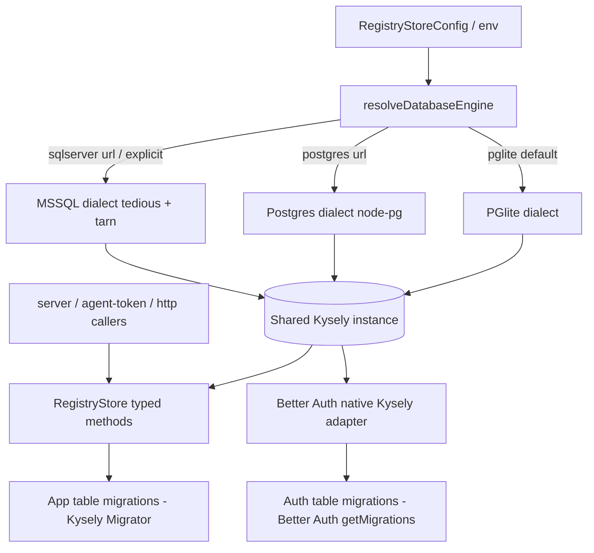

# feat: Engine-portable storage via Kysely (add Azure SQL Server)

## Summary

Route all storage and auth SQL through [Kysely](https://kysely.dev) so the database engine is a configuration choice. The hand-written Postgres SQL in `packages/storage/src/index.ts`, the custom Better Auth adapter, and the scattered ad-hoc `store.query()` callers all move onto a single shared Kysely instance whose dialect (PGlite, PostgreSQL, or Azure SQL Server) is selected from config. PGlite stays the zero-config default; Postgres keeps working; Azure SQL Server becomes the first newly supported engine. Ships engine-agnostic to upstream OSS.

---

## Problem Frame

The registry supports two deployment targets — bundled PGlite and external PostgreSQL — but speaks only **one SQL dialect**, because PGlite is an embedded build of Postgres. Adopters whose org mandates a different engine (the first concrete case: Azure Microsoft SQL Server) cannot run the registry, and there is no connection-string swap that helps: the SQL is hand-written and Postgres-specific.

Phase 1 research confirmed the Postgres-specific SQL spans more than the storage package. `packages/storage/src/index.ts` holds ~22 query methods plus the migration DDL array (`on conflict`, `jsonb`, `timestamptz`, `now()`, `::date`/`::int` casts, `$N`). `apps/server/src/better-auth-adapter.ts` dynamically generates Postgres SQL for every auth operation (`returning *`, `limit $n`, `$N`). And three ad-hoc callers — `apps/server/src/agent-token.ts` (`now()`, `returning`), the admin-bootstrap hook in `apps/server/src/better-auth.ts`, and a user-delete in `apps/server/src/http.ts` — all issue raw Postgres SQL through `RegistryStore.query()`. Every one of these breaks on SQL Server. The dialect lives in application code; a new engine means editing application code unless a dialect-aware layer is introduced.

Kysely ships first-party dialects for PGlite, PostgreSQL, and MSSQL (via `tedious`), and Better Auth runs on Kysely internally with official SQL Server support — so one library covers every engine the project needs and lets the custom adapter be deleted in favor of Better Auth's native Kysely adapter.

---

## Key Technical Decisions

- **Kysely as the single query layer (query builder, not a full ORM).** First-party PGlite/Postgres/MSSQL dialects span every engine while preserving the embedded PGlite default. Prisma was rejected (heavy, no PGlite default); Drizzle's SQL Server dialect is still 1.0-beta on the exact engine needed first (see origin: `docs/brainstorms/2026-06-11-multi-engine-storage-kysely-requirements.md`).
- **One shared Kysely instance feeds both the registry store and Better Auth.** The engine/dialect is resolved once and handed to both, collapsing the two SQL-emitting surfaces into one configuration point.
- **Retire the custom Better Auth adapter for Better Auth's native Kysely adapter.** Deletes `apps/server/src/better-auth-adapter.ts` (~235 lines). Auth-table schema and migrations become Better Auth's responsibility via `getMigrations`.
- **Unify the Postgres path onto Kysely's `pg` dialect.** Resolves the brainstorm's open question — node-`pg` is used only as Kysely's Postgres driver, not as a separate query path, so there is one code path per operation across all engines.
- **Convert every raw `store.query()` caller to a typed Kysely-backed method and retire the raw escape hatch.** `RegistryStore.query(sql, params)` is removed from the public interface so no Postgres-dialect SQL can leak back into application code.
- **`agent_api_token` becomes a Better Auth additional field.** After the adapter swap, the `user` table is Better-Auth-owned; the agent token is declared as an additional field so Better Auth's migration creates the column and it is read/written through the shared instance rather than raw `alter table` + raw SQL.
- **SQL Server tests are opt-in / containerized.** Default CI exercises PGlite + Postgres; a gated job runs the SQL Server matrix, so the common path stays fast while the divergent operations still get real coverage.

### Dialect divergence the implementation must absorb

| Concern | Postgres / PGlite | Azure SQL Server (T-SQL) |
|---|---|---|
| Parameter placeholders | `$1 … $N` | `@p1 … @pN` (Kysely-handled) |
| Upsert | `INSERT … ON CONFLICT DO UPDATE` | `MERGE` |
| Row return | `RETURNING *` | `OUTPUT INSERTED.*` |
| Pagination | `LIMIT n OFFSET m` | `OFFSET m ROWS FETCH NEXT n ROWS ONLY` |
| JSON column | `jsonb` | `nvarchar(max)` (+ app-side parse/stringify) |
| Timestamp / now | `timestamptz` / `now()` | `datetimeoffset` / `sysdatetimeoffset()` |
| Boolean | `boolean` | `bit` |
| Date truncation | `created_at::date` | `CAST(created_at AS date)` |

---

## High-Level Technical Design

One engine resolution feeds a single Kysely instance shared by both SQL-emitting surfaces; each surface owns its own migrations.

Migration ownership is split but co-resident: the app's Kysely Migrator creates registry tables; Better Auth's `getMigrations` creates auth tables. Both run on boot against the same instance.

---

## Requirements

Carried from the origin requirements doc. Engine support: R1 (three engines, config-selected), R2 (PGlite default + existing deployments unchanged), R3 (config-driven selection). Query layer: R4 (all SQL via Kysely), R5 (dialect-divergent ops correct), R6 (JSON round-trips). Auth: R7 (native Kysely adapter), R8 (auth behavior preserved). Migrations: R9 (idempotent fresh-DB migrate per engine), R10 (split schema ownership coexists). Compatibility: R11 (engine-agnostic, upstream OSS), R12 (tested per engine).

Acceptance examples carried forward: AE1 (SQL Server boots+migrates+serves; no-config falls back to PGlite), AE2 (upsert-twice updates not duplicates on Postgres + SQL Server), AE3 (categories JSON round-trips on SQL Server), AE4 (Entra sign-in persists session + links account on SQL Server, no custom adapter).

---

## Implementation Units

### U1. Kysely foundation: dependencies and engine-aware instance factory

**Goal:** Add Kysely and the per-engine drivers, define the database schema types, and build a factory that resolves the engine from config and returns a configured Kysely instance.

**Requirements:** R1, R3.

**Dependencies:** none.

**Files:**
- `packages/storage/package.json` — add `kysely`, `tedious`, `tarn` (and `pg` stays as the Postgres driver; `@electric-sql/pglite` stays).
- `packages/storage/src/kysely.ts` (new) — schema interface types + `createKyselyInstance(config)` dialect factory.
- `packages/storage/src/index.ts` — rename/extend `resolveDatabaseMode` to `resolveDatabaseEngine` returning `pglite | postgres | mssql`.
- `packages/storage/src/kysely.test.ts` (new).

**Approach:** Engine resolution prefers an explicit config/env signal, else infers from the connection scheme (`postgres://` → postgres, `sqlserver://` → mssql), else defaults to `pglite`. Each branch constructs the matching Kysely dialect; MSSQL uses `tedious` + `tarn` pooling, Postgres uses a `pg` pool, PGlite is in-process. The `DatabaseMode` type widens to three values; keep `resolveDatabaseMode` as a thin alias if external callers reference it.

**Patterns to follow:** existing `resolveDatabaseMode` / `resolveStoragePaths` shape in `packages/storage/src/index.ts`.

**Test scenarios:**
- Covers R3. No `databaseUrl` → engine resolves `pglite`; `postgres://…` → `postgres`; `sqlserver://…` or explicit engine setting → `mssql`.
- Happy path: factory returns an instance that runs `select 1` successfully on PGlite.
- Error path: an unrecognized explicit engine value throws a clear configuration error naming the supported engines.

**Verification:** the factory produces a usable Kysely instance for the PGlite default and engine resolution is unit-covered for all three inputs.

### U2. Cross-dialect schema migrations for application tables

**Goal:** Replace the hand-written Postgres DDL array with Kysely migrations that create the registry tables idempotently on every engine, with correct per-dialect column types.

**Requirements:** R4, R6, R9, R10.

**Dependencies:** U1.

**Files:**
- `packages/storage/src/migrations/` (new) — Kysely migration definitions for `workspaces`, `skill_packages`, `artifacts`, `skill_versions`, `lifecycle_events`, `install_reports`, `usage_events`.
- `packages/storage/src/index.ts` — `migrate()` drives the Kysely Migrator instead of looping the DDL array.
- `packages/storage/src/index.test.ts` — migration coverage.

**Approach:** Use the Kysely schema builder with a per-engine column-type helper (JSON → `jsonb`/`nvarchar(max)`; timestamp → `timestamptz`/`datetimeoffset`; boolean → `boolean`/`bit`). Idempotency comes from the migrator's applied-migrations tracking table rather than `if not exists`. Fold the existing orphan-cleanup steps (delete sessions/users with no account) into ordered migration steps. Auth tables are intentionally NOT created here — they are owned by Better Auth (U5).

**Execution note:** start with a failing test asserting a fresh PGlite migrate creates all registry tables, then re-run is a no-op.

**Test scenarios:**
- Covers R9. Fresh PGlite database: `migrate()` creates all registry tables; a second `migrate()` is a safe no-op.
- Covers R6. JSON-bearing columns (`categories`, `validation`, `provenance`) are declared with the engine-appropriate type.
- Edge: column-type helper returns the SQL-Server type variant when the engine is `mssql` (assert builder output without a live SQL Server).
- Integration: foreign-key/cascade relationships (package → workspace, version → package) are created.

**Verification:** fresh-DB migrate succeeds and is idempotent on PGlite; type-mapping is unit-asserted for the mssql branch.

### U3. Port registry CRUD and upserts to Kysely

**Goal:** Rewrite the create/read/update methods (`putArtifact`, `getArtifact`, `getWorkspace`, `upsertWorkspace`, `upsertPackage`, `createVersion`, `transitionVersion`, `listPackages`, `getPackage`, `listVersions`, `getVersion`, `getLatestApprovedVersion`, `recordInstallReport`) through Kysely, absorbing upsert, row-return, and JSON divergence.

**Requirements:** R4, R5, R6.

**Dependencies:** U1, U2.

**Files:**
- `packages/storage/src/index.ts` — the CRUD methods on `SqlRegistryStore`.
- `packages/storage/src/index.test.ts`.

**Approach:** Express each query with the Kysely builder. Provide one upsert helper that branches by dialect (`onConflict` for PGlite/Postgres, `merge` for MSSQL) and one row-return helper (`returningAll` vs. `output`). JSON columns are parsed on read and stringified on write at the store boundary so callers keep working with arrays/objects. The non-SQL in-memory store implementation is unaffected and stays as-is.

**Execution note:** characterization-first — capture current PGlite behavior of these methods in tests before porting, so the rewrite preserves it.

**Patterns to follow:** existing method signatures and row-mapper helpers in `packages/storage/src/index.ts`; keep the `RegistryStore` return shapes identical.

**Test scenarios:**
- Covers AE2. `upsertWorkspace` (and `upsertPackage`) called twice with the same id updates the existing row, producing no duplicate and no error.
- Covers AE3. A package created with a non-empty `categories` array reads back as the identical array; `validation`/`provenance` objects round-trip on a version.
- Happy path: `createVersion` returns the persisted row; `getLatestApprovedVersion` returns the right version.
- Edge: `transitionVersion` on a missing version returns `undefined`; lifecycle transition records a `lifecycle_events` row.
- Integration: deleting a workspace cascades to its packages and versions.

**Verification:** the existing storage test suite (extended) passes on PGlite with all CRUD methods on Kysely; upsert and JSON behavior unchanged from pre-port.

### U4. Port analytics and reporting queries to Kysely

**Goal:** Rewrite the cast- and aggregation-heavy read methods (`countUsageEvents`, `recordUsageEvent`, `getDownloadHistory`, `getPackageReport`, `getWorkspaceCatalogStats`, `getWorkspaceReports`) cross-dialect.

**Requirements:** R4, R5.

**Dependencies:** U1, U2, U3.

**Files:**
- `packages/storage/src/index.ts` — the reporting/analytics methods.
- `packages/storage/src/index.test.ts`.

**Approach:** The date-grouping queries (`created_at::date` grouping in `getDownloadHistory`, catalog stats) need a dialect-aware date-truncation expression (`::date` vs. `CAST(... AS date)`) and integer counts. Use Kysely's `sql` template with a small date-expression helper where the builder lacks a portable primitive. Preserve the gap-filling behavior in `fillDownloadHistory`.

**Test scenarios:**
- Happy path: `getDownloadHistory` returns one point per day across the window, gaps filled with zero counts.
- Edge: `countUsageEvents` filters correctly by workspace, event type, package, and version combinations.
- Happy path: `getWorkspaceCatalogStats` and `getPackageReport` aggregate install/usage counts to the expected totals.

**Verification:** analytics methods return identical results to the pre-port implementation on PGlite for a seeded dataset.

### U5. Replace the custom Better Auth adapter with the native Kysely adapter

**Goal:** Wire Better Auth to the shared Kysely instance, delete the custom adapter, declare `role` and `agent_api_token` as additional fields, and let Better Auth own auth-table schema/migrations.

**Requirements:** R7, R8, R10.

**Dependencies:** U1.

**Files:**
- `apps/server/src/better-auth.ts` — swap `database: createBetterAuthAdapter(store)` for the shared Kysely dialect/instance; add `agent_api_token` to `additionalFields`; change the admin-bootstrap hook to count via the shared instance rather than raw SQL.
- `apps/server/src/better-auth-adapter.ts` — delete.
- `apps/server/src/better-auth-adapter.test.ts` — delete.
- `apps/server/src/serve.ts` — run Better Auth `getMigrations` alongside the app migrations on boot.
- `apps/server/src/better-auth.test.ts` (new or extended).

**Approach:** Pass Better Auth the same engine-resolved Kysely dialect used by the store (R10's split-but-co-resident migrations). Keep the `accountLinking`, `socialProviders.microsoft`, `session`, and admin-bootstrap behavior intact. Better Auth's MSSQL path needs `experimental.joins` enabled.

**Execution note:** before full cutover, smoke-test the known Better Auth MSSQL edge case ([better-auth#3143](https://github.com/better-auth/better-auth/issues/3143)) on a real SQL Server so a blocker surfaces early rather than at the end.

**Test scenarios:**
- Covers AE4. On PGlite, a Microsoft sign-in flow persists a session and links the account, with no custom adapter in the path.
- Happy path: the first created user is assigned `admin`; subsequent users get `user`.
- Happy path: `agent_api_token` is creatable and readable through the Better-Auth-managed `user` table.
- Integration: Better Auth `getMigrations` creates `user`/`session`/`account`/`verification` on a fresh database without colliding with the app migrations from U2.

**Verification:** auth sign-in/session/linking works on PGlite through the native adapter; `better-auth-adapter.ts` is gone and no test references it.

### U6. Convert remaining raw SQL callers and retire the raw query escape hatch

**Goal:** Replace the ad-hoc `store.query()` calls in `agent-token.ts`, the admin-bootstrap hook, and `http.ts` with typed Kysely-backed store methods, then remove the public `query(sql, params)` method from `RegistryStore`.

**Requirements:** R4, R8.

**Dependencies:** U3, U5.

**Files:**
- `packages/storage/src/index.ts` — add typed methods (e.g., `getAgentToken`/`setAgentToken`, `deleteUser`, `countUsers`); remove `query` from the `RegistryStore` interface and both implementations (or make it internal-only).
- `apps/server/src/agent-token.ts` — use the typed token methods.
- `apps/server/src/http.ts` — use `deleteUser` instead of raw `delete from "user"`.
- `apps/server/src/better-auth.ts` — admin-bootstrap uses `countUsers`.
- corresponding tests.

**Approach:** The agent token lives on the Better-Auth-owned `user` table (added as an additional field in U5); read/write it through the shared Kysely instance. Removing the raw `query` method is the enforcement mechanism that prevents Postgres-dialect SQL from re-entering application code.

**Test scenarios:**
- Happy path: `setAgentToken` then `getAgentToken` returns the same token; a second `getAgentToken` is stable (no regeneration).
- Happy path: `actorFromUserAgentToken` resolves the actor for a valid bearer token and returns `undefined` for an unknown one.
- Edge: `deleteUser` removes the user (and cascades) and is safe for a non-existent id.
- Regression guard: no `store.query(` raw-SQL call remains in `apps/` or `packages/cli`/`packages/mcp` (interface removal makes this a type error).

**Verification:** all auth and HTTP behavior preserved; the raw `query` escape hatch no longer exists on the public interface.

### U7. Enable the Azure SQL Server engine: connection, TLS, pooling, config, docs

**Goal:** Fully wire the MSSQL dialect for Azure (encryption/TLS, `tarn` pooling), document engine selection, and surface the new config.

**Requirements:** R1, R3, R11.

**Dependencies:** U1.

**Files:**
- `packages/storage/src/kysely.ts` — MSSQL `tedious` config (Azure requires `encrypt: true`), `tarn` pool sizing; parse `sqlserver://` connection details.
- `.env.example` — document the SQL Server connection/engine selection alongside the existing `DATABASE_URL` comment.
- `docs/architecture.md` and/or `docs/deploy-azure.md` — engine matrix and how to point at Azure SQL Server.
- `apps/server/src/serve.ts` — pass the engine config through (no Rebtech-specific identifiers).

**Approach:** Keep the abstraction engine-agnostic per R11 — no Rebtech hostnames/tenant IDs in the storage/auth layer. Azure SQL requires encryption on; default `tedious` options accordingly.

**Test scenarios:**
- Covers R3. A `sqlserver://` connection target resolves to the `mssql` engine with `encrypt` enabled in the constructed config (asserted without a live server).
- Test expectation: booting against a real SQL Server is exercised in U8; this unit's behavioral coverage is the config/parsing path only.

**Verification:** SQL Server connection config is correct and documented; engine selection works end-to-end with U1.

### U8. Cross-engine test matrix and Better Auth MSSQL validation

**Goal:** Run the data-layer and auth tests against PGlite, Postgres, and (opt-in/containerized) SQL Server, with explicit coverage of the dialect-divergent operations and the SQL Server sign-in path.

**Requirements:** R5, R8, R12, R9.

**Dependencies:** U2, U3, U4, U5, U6, U7.

**Files:**
- `packages/storage/src/` test harness — parametrize store tests by engine.
- a containerized SQL Server setup (e.g., `docker-compose` service or testcontainers) gated behind an env flag.
- CI config — a GitHub Actions workflow (upstream OSS) running PGlite + Postgres by default and a gated SQL Server job. Note the fork's `azure-pipelines.yml` separately if it must mirror.
- `docs/` — how to run the SQL Server test matrix locally.

**Approach:** Default CI stays fast (PGlite + Postgres). The SQL Server job is opt-in via flag so contributors without a SQL Server aren't blocked. The matrix reuses the same store test suite across engines via the U1 factory.

**Test scenarios:**
- Covers AE1. On SQL Server: the app boots, runs both migration owners, and serves; with no DB configured the same code falls back to PGlite.
- Covers AE2, AE3. On SQL Server: upsert-twice updates not duplicates; `categories` JSON round-trips; pagination returns the right page.
- Covers AE4. On SQL Server: a Microsoft sign-in persists a session and links the account (validates issue #3143 is not a blocker).
- Covers R9. Fresh SQL Server database migrates idempotently.

**Verification:** the full store + auth suite passes on each engine; the SQL Server job is green and the divergent operations are explicitly asserted.

---

## Scope Boundaries

### Deferred for later (from origin)
- MySQL and SQLite engine support — cheap to add once the Kysely layer exists, but not part of this work.
- A data-migration / export tool to move existing data between engines.

### Outside this product's identity (from origin)
- Becoming a general multi-tenant database service, or supporting non-SQL stores.
- Cross-engine live replication, heterogeneous sharding, or running multiple engines simultaneously in one deployment.

### Deferred to Follow-Up Work
- Refactoring the separate non-SQL in-memory `RegistryStore` implementation — it does not use SQL and is unaffected; leave as-is.

---

## Risks & Mitigations

- **Better Auth MSSQL edge case (#3143) blocks auth on SQL Server.** Highest-impact unknown. Mitigation: U5 smoke-tests the sign-in/token-exchange path on real SQL Server before full cutover, not after.
- **Auth regression during adapter swap.** Replacing the hand-written adapter changes the auth data path. Mitigation: U5 keeps `accountLinking`/`socialProviders`/admin-bootstrap behavior intact and is characterization-tested on PGlite first; U8 re-validates on SQL Server.
- **Upsert/JSON divergence subtly changes behavior.** `MERGE` and `nvarchar(max)` JSON differ from `ON CONFLICT`/`jsonb`. Mitigation: U3 characterization tests pin pre-port behavior; U8 asserts the divergent ops on SQL Server.
- **Migration ownership collision.** App Kysely migrator and Better Auth `getMigrations` both run on boot. Mitigation: U2 owns only registry tables, U5 owns only auth tables; U5 integration test asserts no collision on a fresh DB.
- **PGlite default regresses.** The bundled zero-config path must keep working. Mitigation: PGlite is the default branch in U1 and the primary engine in every unit's tests.

---

## Open Questions (deferred to implementation)

- Exact engine-selection signal: scheme-inference from the connection target vs. an explicit engine env var (U1 picks the mechanism during implementation; both are config-only).
- Whether Better Auth's `getMigrations` runs cleanly headless for all three dialects or needs per-engine handling (surfaces in U5/U8).
- `tarn` pool sizing defaults for Azure SQL vs. Postgres (tuned in U7 against real connections).
- Final date-truncation expression form per dialect in the analytics queries (settled in U4 against real engines).

---

## Sources & Research

- `packages/storage/src/index.ts` — `RegistryStore` interface, `resolveDatabaseMode`, migration DDL array, ~22 query methods; the second non-SQL in-memory store.
- `apps/server/src/better-auth.ts`, `apps/server/src/better-auth-adapter.ts`, `apps/server/src/agent-token.ts`, `apps/server/src/http.ts` — auth wiring and the raw `store.query()` callers to convert.
- `packages/storage/src/index.test.ts` — PGlite temp-dir test harness to parametrize.
- [Kysely dialects](https://kysely.dev/docs/dialects) — first-party PGlite / Postgres / MSSQL support (load-bearing for the Kysely KTD).
- [Better Auth — MS SQL adapter](https://better-auth.com/docs/adapters/mssql) — native Kysely-based SQL Server support, `experimental.joins`, `getMigrations`.
- [better-auth#3143](https://github.com/better-auth/better-auth/issues/3143) — known MSSQL edge case to validate in U5.
- Alternatives considered: [Drizzle MSSQL](https://orm.drizzle.team/docs/get-started-mssql) (1.0-beta), Prisma `sqlserver` (mature but heavy, no PGlite default).
